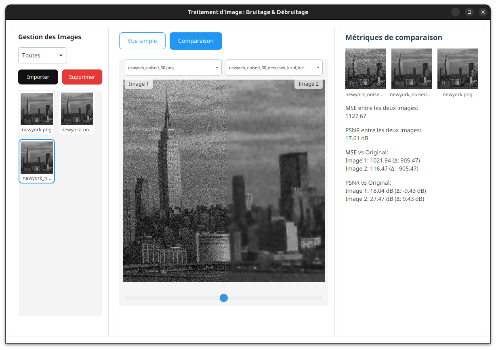
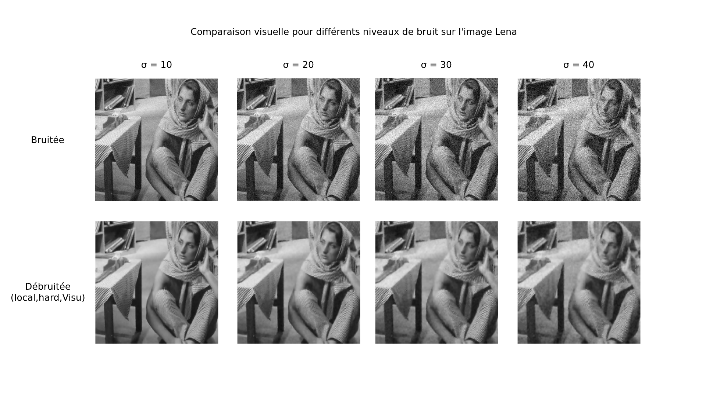

# Image Denoising PCA

Projet réalisé en 2025 dans le cadre d'une SAE à CY Tech Pau. 

Implémentation en Java d'un algorithme de débruitage d'image basé sur l'Analyse en Composantes Principales (ACP / PCA).



## ING1 Groupe 10
- BIOUDI Matheo
- BOURGEAT Ewen
- CAPBLANCQ Sylvain
- COUSIN Paul
- MARTIAL Clément

## Prérequis

- Java 17 ou supérieur
- Maven 3.6 ou supérieur

## Structure du projet

```
image-denoising-PCA/
├── src/
│   ├── core/           # Code principal du débruitage
│   └── cli/            # Interface en ligne de commande
│   └── gui/            # Interface graphique
├── img/
│   ├── original/       # Images originales (inclut lena.png et autres images de test)
│   ├── img_noised/     # Images bruitées (générées automatiquement)
│   ├── img_denoised/   # Images débruitées (générées automatiquement)
│   └── benchmark/      # Résultats des benchmarks (générés automatiquement)
├── diagrammes/         # Diagrammes du projet
└── pom.xml            # Configuration Maven
```

> **Note** : Le dossier `img/original/` contient déjà plusieurs images de test, dont `lena.png` qui est utilisée dans les exemples. Vous pouvez utiliser vos propres images en les plaçant dans ce dossier.

## Dépendances

- Utilisation d'Apache Common Maths3 pour l'ACP

## Compilation et Installation

1. Cloner le projet :
```bash
git clone https://github.com/ING1-Groupe10-CYTech25/image-denoising-PCA.git
cd image-denoising-PCA
```

2. Compiler le projet :
```bash
mvn clean compile
```

3. Générer le fichier JAR exécutable (et des archives de sources et de javadoc) :
```bash
mvn clean package
```

### Le fichier JAR sera généré à la racine du projet avec le nom `image-denoising-PCA.jar`.
D'autres types d'archives (sources et javadocs) sont accessibles dans `target`

La javadoc sera aussi directement accessible dans `target/apidocs/index.html`

## Utilisation

Toutes les commandes s'exécutent avec le fichier JAR généré :

```bash
java -jar image-denoising-PCA.jar <commande> [options]
```

# Lancer l'interface graphique

```bash
java -jar image-denoising-PCA.jar gui
```

## Commandes disponibles

#### 1. Ajouter du bruit à une image (`noise`)

```bash
java -jar image-denoising-PCA.jar noise -i <chemin_image> [-o <chemin_sortie>] [-s <sigma>]
```

Options :
- `-i, --input` : Chemin vers l'image à bruiter (obligatoire)
- `-o, --output` : Chemin pour l'image bruitée (optionnel)
- `-s, --sigma` : Écart type du bruit (défaut: 30.0)
- `-h, --help` : Affiche l'aide

Exemple :
```bash
java -jar image-denoising-PCA.jar noise -i img/original/lena.png -s 30
```

#### 2. Débruiter une image (`denoise`)

```bash
java -jar image-denoising-PCA.jar denoise -i <chemin_image> [-o <chemin_sortie>] [-g|--global] [-l|--local] [-t <type>] [-sh <type>] [-s <sigma>] [-pp <percent>]
```

Options :
- `-i, --input` : Chemin vers l'image ou le dossier d'images à débruiter (obligatoire)
- `-o, --output` : Chemin pour l'image débruitée ou le dossier de sortie (optionnel)
- `-g, --global` : Active la méthode de débruitage globale
- `-l, --local` : Active la méthode de débruitage locale (défaut)
- `-t, --threshold` : Type de seuillage (hard/h ou soft/s, défaut: hard)
- `-sh, --shrink` : Type de seuillage adaptatif (v pour VisuShrink, b pour BayesShrink)
- `-s, --sigma` : Écart type du bruit (défaut: déduit ou 30.0)
- `-pp, --patchPercent` : Pourcentage de la taille minimale pour le patch (entre 0 et 1, défaut: 0.05, soit 10%)
- `-h, --help` : Affiche l'aide

Exemple avec une seule image :
```bash
java -jar image-denoising-PCA.jar denoise -i img/img_noised/lena_noised_30.png -t hard -sh v -s 30 -pp 0.05
```

Exemple avec méthode globale :
```bash
java -jar image-denoising-PCA.jar denoise -i img/img_noised/lena_noised_30.png -g -t soft -sh b -pp 0.05
```

Exemple avec un dossier d'images :
```bash
java -jar image-denoising-PCA.jar denoise -i img/img_noised/ -o img/img_denoised/ -t hard -sh v
```

Lorsque vous spécifiez un dossier en entrée :
- Toutes les images du dossier seront traitées (formats supportés : PNG, JPG, JPEG, BMP, GIF, TIFF)
- Les images débruitées seront sauvegardées dans le dossier de sortie spécifié
- Le nom de chaque image débruitée inclura la méthode et les paramètres utilisés

#### 3. Évaluer la qualité (`eval`)

```bash
java -jar image-denoising-PCA.jar eval -i1 <chemin_image1> -i2 <chemin_image2> [-m <type>]
```

Options :
- `-i1, --image1` : Chemin vers la première image (obligatoire)
- `-i2, --image2` : Chemin vers la deuxième image (obligatoire)
- `-m, --metric` : Type de métrique (mse/psnr/both, défaut: both)
- `-h, --help` : Affiche l'aide

Exemple :
```bash
java -jar image-denoising-PCA.jar eval -i1 img/original/lena.png -i2 img/img_noised/lena_noised_30.png
```

#### 4. Effectuer un benchmark (`benchmark`)

```bash
java -jar image-denoising-PCA.jar benchmark -i <chemin_image> [-o <chemin_sortie>] [-s <sigma>] [-pp <pourcentage>]
```

Options :
- `-i, --input` : Chemin vers l'image à tester (obligatoire)
- `-o, --output` : Répertoire de sortie pour les résultats (optionnel)
- `-s, --sigma` : Écart type du bruit (défaut: 30.0)
- `-pp, --patchPercent` : Pourcentage de la taille minimale pour le patch (entre 0 et 1, défaut: 0.05)
- `-h, --help` : Affiche l'aide

Exemple :
```bash
java -jar image-denoising-PCA.jar benchmark -i img/original/lena.png -s 30 -pp 0.05
```

La commande `benchmark` effectue un test complet sur l'image en :
1. Ajoutant du bruit gaussien avec le sigma spécifié
2. Testant toutes les combinaisons possibles de méthodes de débruitage :
   - Méthode globale et locale
   - Seuillage dur et doux
   - VisuShrink et BayesShrink
   - Avec la taille de patch spécifiée (par défaut 10% de la plus petite dimension)
3. Évaluant les résultats avec les métriques MSE et PSNR
4. Sauvegardant toutes les images débruitées et un rapport détaillé

Les résultats sont organisés dans des sous-répertoires nommés `<nom_image>_benchmark_<sigma>` contenant :
- L'image bruitée
- Les images débruitées pour chaque configuration
- Un fichier `benchmark.txt` avec les métriques détaillées

## Taille de patch adaptative

- **Par défaut**, la taille des patchs est fixée à 5% de la plus petite dimension de l'image (ou de l'imagette en mode local).
- Vous pouvez la modifier avec l'option `-pp` ou `--patchPercent` (ex : `-pp 0.05` pour 5%).
- **En mode global** : la taille de patch dépend de l'image entière.
- **En mode local** : la taille de patch dépend de chaque imagette (découpage automatique, 16 imagettes par défaut).
- La taille minimale d'un patch est 5 pixels, la maximale 31 pixels, et elle est toujours impaire.
- Si le pourcentage choisi donne une taille inférieure à 5, la taille minimale (5) est utilisée.

## Limitations

- Seules les images en niveaux de gris sont supportées
- Les formats d'image supportés sont : PNG, JPG, JPEG, BMP, GIF, TIFF
- **La taille des patchs est adaptative** (voir plus haut), mais reste comprise entre 5 et 31 pixels et toujours impaire
- Les images à comparer pour l'évaluation doivent avoir exactement les mêmes dimensions

# Manuel d'utilisation - Commande EVAL

Cette documentation détaille l'utilisation de la commande `eval` de l'outil image-denoising-PCA. Cette commande permet d'évaluer la qualité entre deux images en utilisant des métriques objectives comme MSE et PSNR.

## Utilisation en ligne de commande

### Syntaxe

```bash
eval --image1 <chemin> --image2 <chemin> [--metric <type>]
```

### Options

| Option | Format court | Description | Statut |
|--------|-------------|-------------|--------|
| `--image1 <chemin>` | `-i1 <chemin>` | Chemin vers la première image (généralement l'original) | **Obligatoire** |
| `--image2 <chemin>` | `-i2 <chemin>` | Chemin vers la deuxième image (généralement l'image traitée) | **Obligatoire** |
| `--metric <type>` | `-m <type>` | Type de métrique à utiliser: 'mse', 'psnr' ou 'both' | *Facultatif* (défaut: 'both') |

### Métriques disponibles

- **MSE** (Mean Square Error / Erreur Quadratique Moyenne): Mesure la différence moyenne des carrés des erreurs entre pixels. Plus la valeur est basse, plus les images sont similaires.
- **PSNR** (Peak Signal-to-Noise Ratio / Rapport Signal/Bruit de Crête): Évalue la qualité de reconstruction d'une image compressée ou altérée. Plus la valeur est élevée, meilleure est la qualité.

### Exemples

1. Évaluer deux images en utilisant les deux métriques (MSE et PSNR) :
   ```bash
   java -jar image-denoising-PCA.jar eval --image1 img/original/lena.png --image2 img/img_noised/lena_noised_10.png
   ```

2. Calculer uniquement l'erreur quadratique moyenne (MSE) :
   ```bash
   java -jar image-denoising-PCA.jar eval -i1 img/original/lena.png -i2 img/img_noised/lena_noised_10.png -m mse
   ```

3. Calculer uniquement le rapport signal/bruit (PSNR) :
   ```bash
   java -jar image-denoising-PCA.jar eval -i1 img/original/lena.png -i2 img/img_noised/lena_noised_10.png -m psnr
   ```

## Utilisation en mode interactif

Pour une utilisation guidée, lancez le programme avec l'argument prompt :

```bash
java -jar image-denoising-PCA.jar prompt
```

1. Choisissez l'option 3 : "Évaluer la qualité du débruitage (eval)"
2. Suivez les instructions pour spécifier :
   - Le chemin de l'image originale
   - Le chemin de l'image débruitée
   - La métrique à utiliser

## Interprétation des résultats

### MSE (Mean Square Error)
- **Valeur idéale** : 0 (images identiques)
- **Interprétation** : Plus la valeur est proche de 0, moins il y a de différences de pixels entre les deux images

### PSNR (Peak Signal-to-Noise Ratio)
- **Valeur idéale** : ∞ (images identiques)
- **Interprétation** :
  - >40 dB : Excellent (différences imperceptibles)
  - 30-40 dB : Très bon (différences difficilement perceptibles)
  - 20-30 dB : Bon (légères différences visibles)
  - <20 dB : Qualité moyenne à faible (différences notables)

## Limitations

- Les images à comparer doivent avoir exactement les mêmes dimensions
- L'évaluation porte sur les différences pixel par pixel et ne reflète pas nécessairement la perception visuelle humaine
- Pour les images couleur, l'erreur est calculée séparément sur les canaux R, G et B puis moyennée

## Messages d'erreur courants

- `--image1 est obligatoire` : Vous devez spécifier le chemin de la première image
- `--image2 est obligatoire` : Vous devez spécifier le chemin de la deuxième image
- `Les images doivent avoir les mêmes dimensions` : Les dimensions des deux images ne correspondent pas
- `Format d'image non supporté` : L'extension du fichier n'est pas reconnue
- `Métrique non supportée` : La métrique spécifiée n'est pas valide (utilisez 'mse', 'psnr' ou 'both')

# Comparaison entre images bruitées et débruitées
